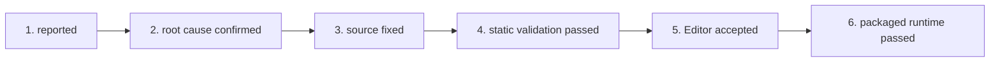

# 测试反馈与问题生命周期

本页用于分诊 bug 报告、playtest 反馈和编辑器告警。

---

## 六阶段问题生命周期

每个上报的 bug 或缺陷都必须严格走这条生命周期：

1. **`reported`**：问题记入当前账本（`sc2agent-records/<project>/issues.md`），带复现上下文：
   - 地图 / 任务
   - 玩家/阵营配置
   - 观察到的行为与预期行为
   - 确切的 SC2 编辑器告警文本或游戏内错误日志（来自 `bugreport.txt`）
2. **`root cause confirmed`**：定位到根因 catalog ID、父级继承缺陷或 Galaxy 脚本逻辑错误。
3. **`source fixed`**：工作区源文件（`Base.SC2Data/GameData/*.xml`、`Base.SC2Data/Scripts/*.galaxy` 等）已更新。
4. **`static validation passed`**：`python tools/test-suite.py` 零错误执行完毕。
5. **`Editor accepted`**：SC2 编辑器干净地打开改动后的模组/地图，没有 XML schema 告警、依赖缺失错误或触发器编译失败。
6. **`packaged runtime passed`**：改动已在游戏内测试并验证。

## 结论措辞要求

每份交接与完成报告都必须写明实际达到的最高闸门。用确切的生命周期标签；只有静态证据时，不要用「已完全修复」「完成」「就绪」这类含糊说法。

- 零退出的预检运行只授权 **`static validation passed`**。
- **`Editor accepted`** 需要操作编辑器的人报告受影响的组件源已干净重载/编译/保存。
- **`packaged runtime passed`** 需要有记录的游戏内复现步骤和观察到的结果。

`tools/audit-issue-lifecycle.py` 强制当前账本使用合法的状态标签，以及每个已达闸门所需的证据字段。

---

## 问题受理规则

- **数值改动：** 编辑 XML 数值前，把本地 catalog 条目、父级、继承值与打算做的覆盖记进账本。
- **UI 与文本修复：** 改 `GameStrings.txt` 或 `ObjectStrings.txt` 之前，先确定确切的 UI 面（世界悬停、选择卡、命令卡按钮、提示框或编辑器文本）及其生效的本地化锚点。
- **运行时日志提取：** 一轮 playtest 之后跑 `python tools/extract-playtest-bugreport.py`，把 `Alerts.txt` 与 `ScriptError.txt` 的条目提取到 `bugreport.txt`。

---

## 账本维护

在 `sc2agent-records/<project>/issues.md` 维护当前问题账本。保持当前账本精简。长期系统事实移到主题正页，不要留在当前账本里的冗长历史讨论中。
